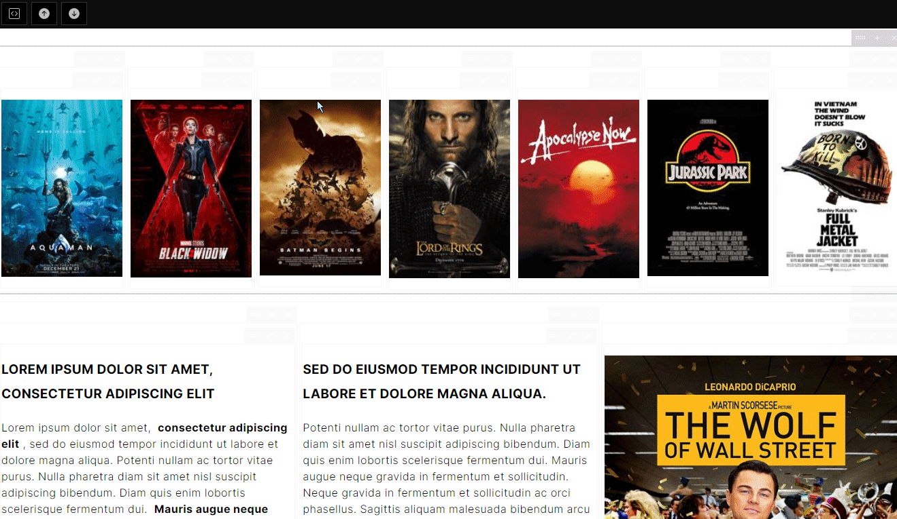

# Introducción

Proyecto práctico para ver como funciona el tema drag & drop content builder, en esta caso he usado *React* y *Shortablejs* para la estructura y luego el texto dentro de los bloques es en formato *Markdown* y se convierte a html con *Marked*.

Se han creado botones para agregar contendores encima o debajo ademas de un boton para descargar el archivo Json de la estructura.

## Instalación 

He usado Yarn para la instalación de los modulos por que para mi gusto es mas rapido que npm aunque támbien se podria.

Añadimos los modulos con `yarn install` y para empezar a trastear usamos `yarn start` y para compilar `yarn build`.

## Futuro próximo

La finalidad de este proyecto sera crear un editor con un formato diferente a lo visto y con la posibilidad de añadir bloques de Markdown ya predefinidos para hacer mas rápida la edición del contenido y poderlos guardar en una base de datos.